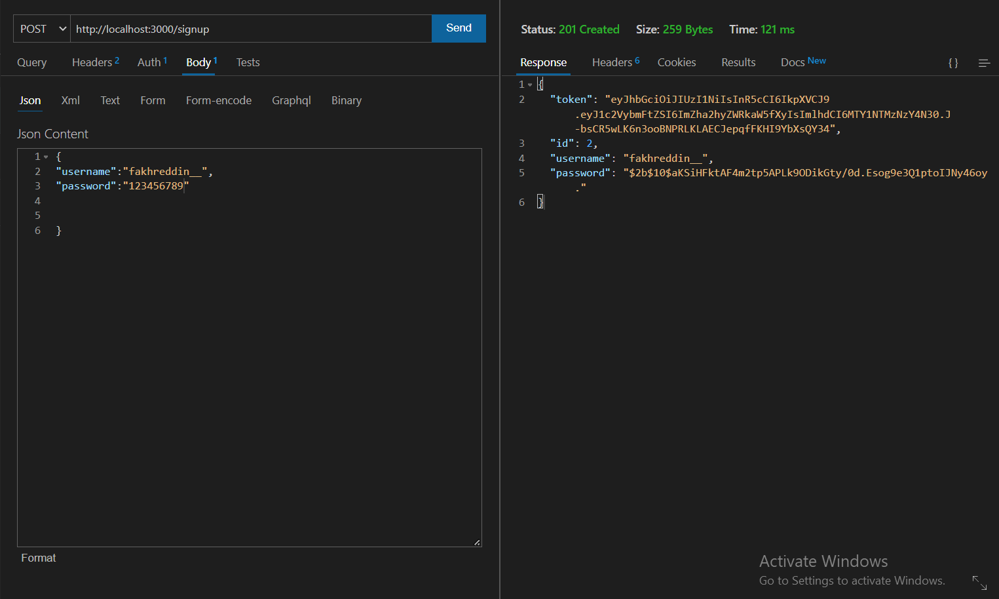
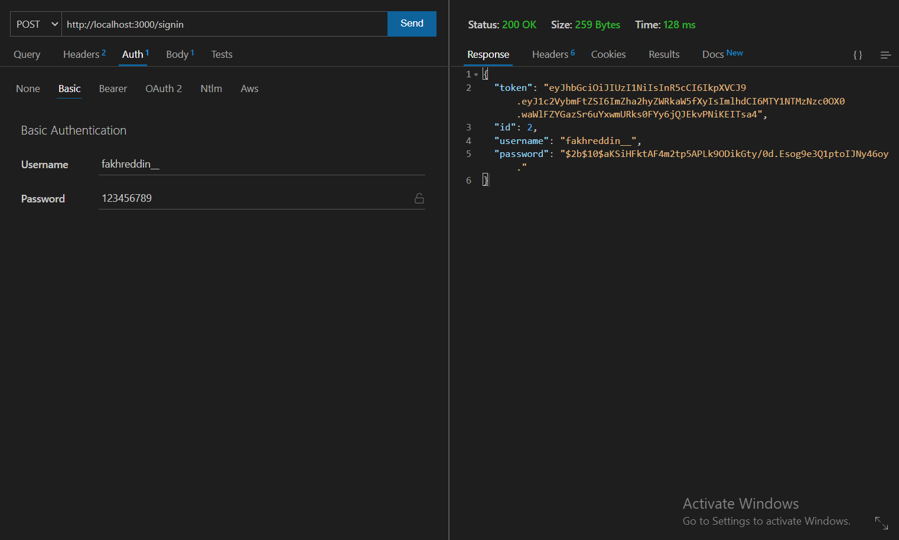
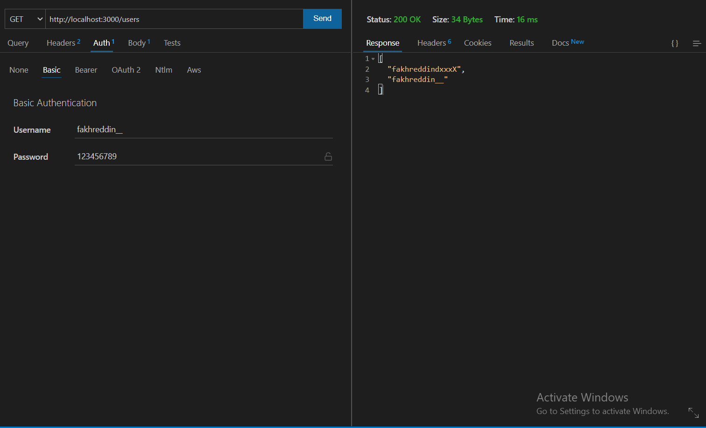
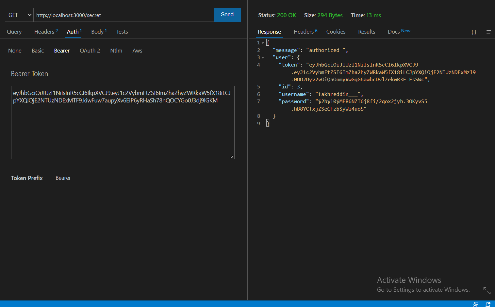
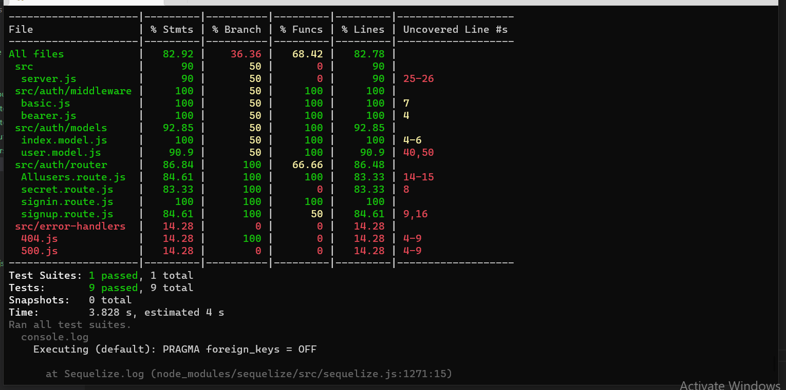

# bearer-auth

[Heroku app ](https://bearer-auth-fakreddin.herokuapp.com/)

[Pull requests ](https://github.com/h4mz411y/bearer-auth/pulls)

[Github](https://github.com/h4mz411y/bearer-auth)

## test 

